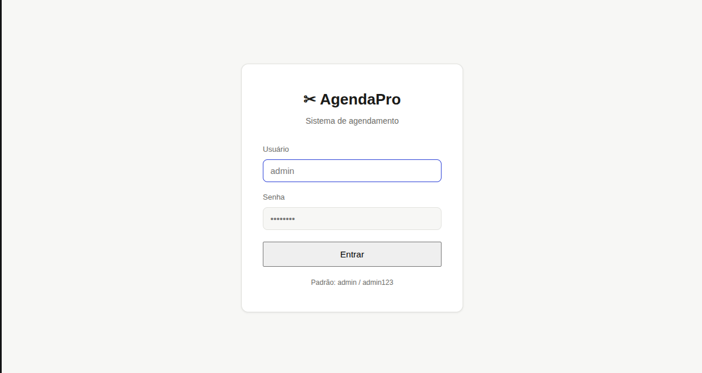
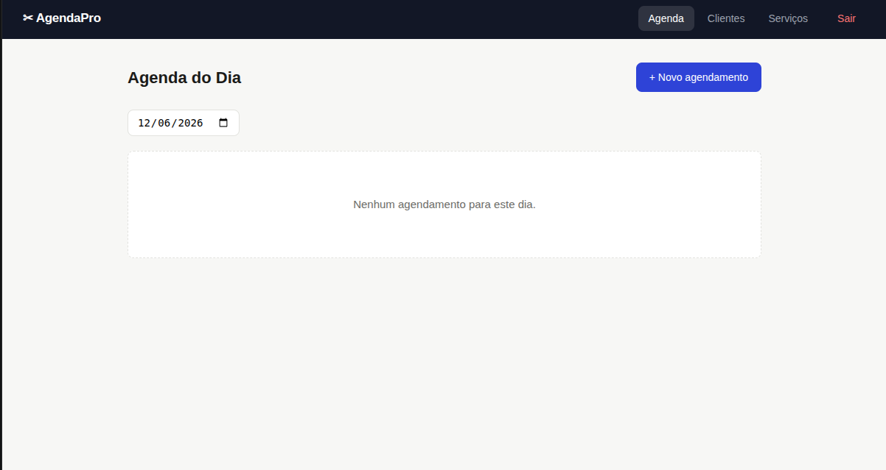
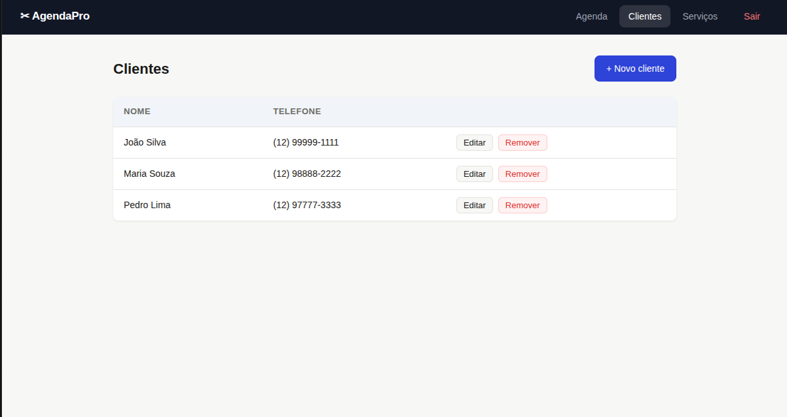
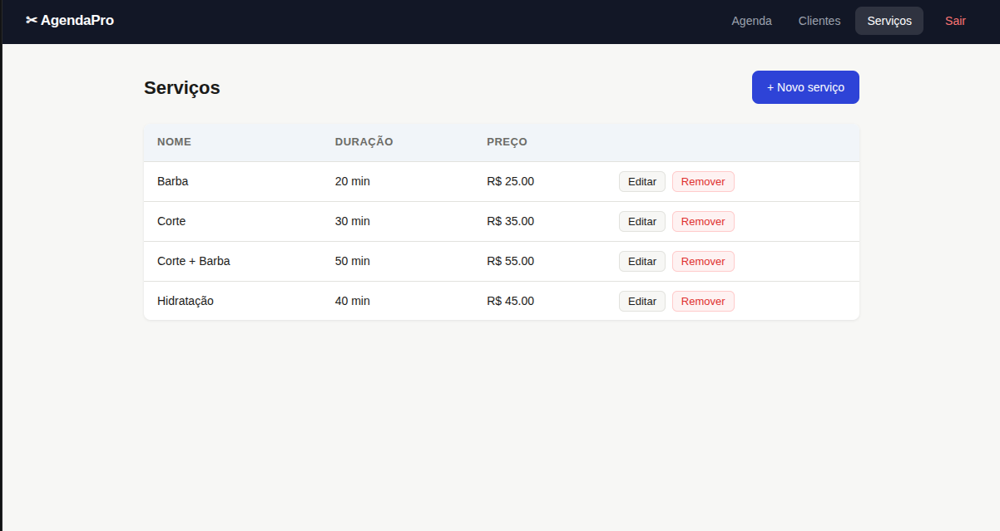

# AgendaPro 📅

Sistema web de agendamento para pequenos negócios como barbearias, clínicas e salões.

> Desenvolvido com Python, Flask e SQLite — rodando 100% no navegador, sem instalação para o usuário final.

---

## 📸 Demonstração

<!-- Adicione prints ou um GIF do sistema funcionando aqui -->
<!-- Dica: arraste as imagens direto no editor do GitHub -->

| Tela de Login | Agenda do Dia |
|:---:|:---:|
|  |  |

| Clientes | Novo Agendamento |
|:---:|:---:|
|  |  |

---

## ✅ Funcionalidades

- Login de administrador
- Agenda do dia com filtro por data
- Cadastro e gerenciamento de clientes
- Cadastro de serviços com duração e preço
- Criar e remover agendamentos

---

## 🛠 Tecnologias

- **Python 3**
- **Flask** — framework web
- **SQLite** — banco de dados local
- **Jinja2** — templates HTML
- **HTML + CSS** puro

---

## 🚀 Como rodar localmente

```bash
# 1. Clone o repositório
git clone https://github.com/JoaoBarreto3/agendapro.git
cd agendapro

# 2. Crie e ative o ambiente virtual
python3 -m venv venv
source venv/bin/activate  # Linux/Mac
venv\Scripts\activate     # Windows

# 3. Instale as dependências
pip install -r requirements.txt

# 4. Rode o servidor
python3 app.py
```

Acesse **http://localhost:5000**

**Login padrão:** usuário `admin` / senha `admin123`

---

## 📁 Estrutura do Projeto

```
agendamento/
├── app.py            # Rotas e lógica principal
├── database.py       # Configuração e criação do banco
├── requirements.txt
├── static/
│   └── css/style.css
└── templates/
    ├── base.html
    ├── login.html
    ├── agendamentos.html
    ├── form_agendamento.html
    ├── clientes.html
    ├── form_cliente.html
    ├── servicos.html
    └── form_servico.html
```

---

## 👨‍💻 Autor

**João Barreto**
[github.com/JoaoBarreto3](https://github.com/JoaoBarreto3)